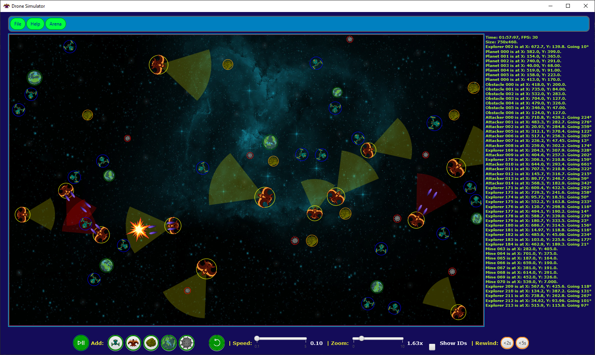

# Drone_Simulation
Simulator written in Java using the JavaFX library for GUI, where different spacecrafts (drones) and other entities can be placed into an arena for simulation.

## Overview   
   

## OOP Design   
  